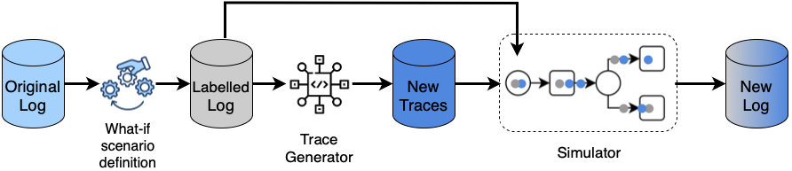

# WISDOM: Enhanced What-If Scenarios Generation by Bridging Generative Models and Process Simulation

Generative Artificial Intelligence (Gen AI) techniques have recently emerged as promising tools for challenges in Process Mining such as missing data, small datasets, and the generation of complex what-if scenarios. A major limitation of current approaches is their inability to produce sets of process traces in a mutually dependent manner. Traces are generated independently, failing to reflect crucial process-level phenomena such as concurrency, resource contention, and workload distribution. This limitation significantly reduces the realism and utility of the generated logs, yet has received limited attention in the literature.

In contrast, Business Process Simulation (BPS) excels at preserving process constraints and interdependencies. However, in the presence of specific or complex what-if scenarios, this requires the adjustment of several 
simulation parameters, which can be challenging to achieve. 

Motivated by these issues, where generative methods lack consistency and BPS methods lack flexibility, we propose a novel data generation framework that combines Gen AI with BPS. The proposed approach allows the generation of diverse and complex what-if scenarios via data-driven generative models, which are then validated and refined through BPS to ensure consistency and feasibility at the log level. We call the proposed approach What-If Scenarios via Data-driven generative mOdels and siMulation (\pmethod).

We compare several existing methods for process data generation and assess their outputs using an established evaluation framework. Results show that while generative methods alone fail to capture the full intricacies of process behaviour, their integration with BPS produces traces that are both diverse and compliant with process constraints. This hybrid approach addresses a critical gap in the literature and opens new avenues for robust, simulation-grounded generation methods in process mining.

